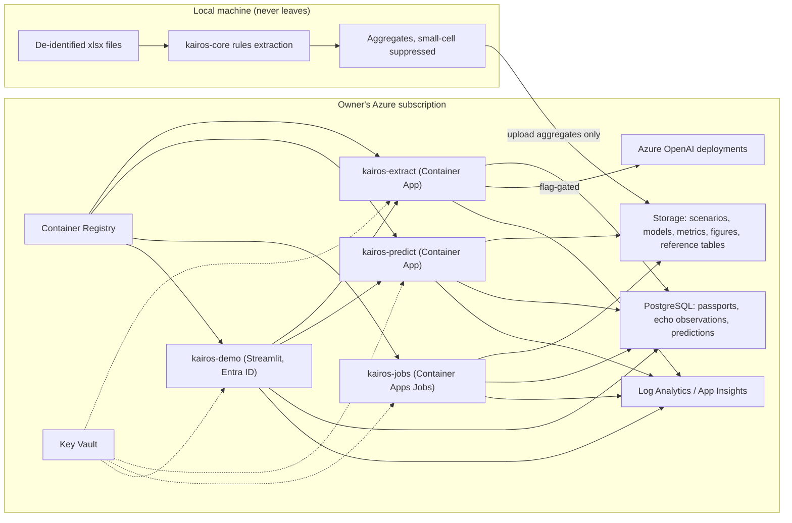

# KAIROS on Azure: build design

Design for developing and deploying the KAIROS research prototype in the owner's Azure subscription. Written for whoever implements it, working in the repository root. The scientific specification is `docs/kairos_proposal_revised.html`; this document turns it into components, interfaces, Azure resources, milestones and acceptance criteria. Where a choice depends on something only the owner knows, the assumption is stated and marked **ASSUMPTION**.

## 0. Ground rules for the implementation

1. **Scope is a research prototype**, not a clinical product. Every user-facing surface labels model outputs as trained on synthetic scenarios, illustrative and unvalidated. No claim of clinical accuracy anywhere in code, UI or docs.
2. **No patient-level data enters the repository.** The three de-identified spreadsheets at the repository root are never committed, never placed in a public container, never logged. If a job needs them in Azure, they are staged in the private `raw` container of the storage account under the owner's identity and deleted when the job is done. Aggregates with small-cell suppression may be committed and uploaded.
3. **Real de-identified notes may be sent to Azure OpenAI in Sweden Central.** The owner confirmed on 16 September 2026 that the organisers' terms permit this. The extraction service keeps the configuration flag `ALLOW_REAL_NOTES_TO_LLM`, off by default in code and switched on in the deployment parameters, read from configuration and never from a request, so the owner can switch it off in one place. Every request records whether its input was real or synthetic. Extracted fields and aggregates are stored; note text is not stored in the database and is not written to logs.
4. **Reuse the existing package.** `src/kairos/` already holds `passport.py` (rule-based extraction), `varc3.py` (staging), `km_reconstruct.py`, the build scripts and 39 passing tests. Extend it; do not rewrite it. Keep the tests green in CI.
5. **Everything reproducible from one command.** `azd up` provisions and deploys; `make all` (or `invoke all`) rebuilds every artefact locally from the raw sources and the scenario config.
6. **Do not change the scientific definitions.** Endpoints, time zero, the three predicted quantities, the leakage rules and the module structure are fixed by the specification. If an implementation detail forces a deviation, record it in `docs/deviations.md` and stop for review rather than silently adapting.

## 1. What gets built

| Component | Purpose | Form on Azure |
|---|---|---|
| `kairos-core` | Python package: passport extraction (rules), VARC-3 staging, landmark dataset builder, cause-specific survival model, cumulative-incidence combination, evaluation metrics, scenario generator | Library shared by all services; built into every container |
| `kairos-extract` | HTTP service: note text in, valve passport JSON out with evidence spans and confidence; rules first, hosted model second under the flag | Azure Container Apps (HTTP) |
| `kairos-predict` | HTTP service: passport plus echo history and optional module inputs in; the three probabilities at 1, 3, 5 years and the 12-month risk out, with drivers, reliability statement and message classification | Azure Container Apps (HTTP) |
| `kairos-jobs` | Batch jobs: generate scenarios, train the model, evaluate the model ladder, write metrics and figures | Azure Container Apps Jobs, manual and scheduled triggers |
| `kairos-demo` | The one-patient demonstration: record, passport, trajectory, updated risk, explanation, three separated messages | Streamlit in Azure Container Apps behind Entra ID authentication |
| Data layer | Synthetic scenarios, model artefacts, metrics, figures, reference tables, aggregates | Azure Storage (Blob with hierarchical namespace) plus Azure Database for PostgreSQL Flexible Server for passports and predictions |
| Platform | Identity, secrets, telemetry, images | Managed identities, Key Vault, Log Analytics and Application Insights, Azure Container Registry |
| Models | Structured extraction and, optionally, adjudication assistance | Azure OpenAI (Azure AI Foundry) deployments, see §4 |

### Architecture



## 2. Repository layout to produce

```
kairos-avr\
  src\kairos\                 existing package, extended
    extraction\               rules.py (existing logic), llm.py (hosted model), schema.py
    adjudication\             varc3.py (existing), framework.py (candidate flags, uncertain class)
    modelling\                landmark.py, cause_specific.py, cif.py, modules.py, reference_model.py
    simulation\               scenarios.py (reads config/scenarios.yaml), generators.py
    evaluation\               metrics.py (calibration, Brier, IPCW AUC), ladder.py, plots.py
    io\                       storage.py (Blob), db.py (Postgres), config.py (settings, flags)
  services\
    extract\                  FastAPI app, Dockerfile
    predict\                  FastAPI app, Dockerfile
    jobs\                     CLI entrypoints for scenarios, train, evaluate; Dockerfile
    demo\                     Streamlit app; Dockerfile
  infra\                      Bicep modules and main.bicep; azure.yaml for azd
  .github\workflows\          ci.yml (tests, privacy scan, lint)
  config\                     scenarios.yaml (existing), model.yaml, app.yaml
  tests\                      existing plus service and schema tests
  docs\                       specification, this design, deviations.md, runbook.md
```

## 3. Interfaces

All payloads are JSON validated by Pydantic models in `src/kairos/extraction/schema.py`; the same models generate the OpenAPI documents for both services.

### 3.1 Passport

```json
{
  "passport_id": "uuid",
  "source": {"note_ref": "string, opaque", "note_type": "operative|procedure|progress|discharge", "date": "YYYY-MM-DD or YYYY"},
  "route": "SAVR|TAVR|unknown",
  "canonical_model": "string from device_table.csv or null",
  "design_class": "string from device_table.csv or null",
  "generation": "string or null",
  "size_mm": "integer or null",
  "implant_date": "YYYY-MM-DD or YYYY or null",
  "market_status": "active|withdrawn|discontinued|unknown",
  "evidence": [{"field": "canonical_model", "span": [start, end], "text": "string", "method": "rule|llm"}],
  "confidence": {"route": 0.0, "canonical_model": 0.0, "size_mm": 0.0},
  "events": [{"type": "valve_in_valve|redo|dysfunction|endocarditis|thrombosis", "date": "...", "span": [start, end]}]
}
```

### 3.2 Echo observation

```json
{"passport_id": "uuid", "date": "YYYY-MM-DD", "mean_gradient_mmhg": 12, "peak_velocity_ms": 2.4,
 "eoa_cm2": 1.6, "dvi": 0.45, "ar_grade": "none|trace|mild|moderate|severe", "lvef_pct": 58,
 "svi_ml_m2": 38, "native_vs_prosthetic": "prosthetic|native|uncertain", "source": "rule|llm|manual"}
```

### 3.3 Exposure timeline (anticoagulant module input)

```json
{"passport_id": "uuid", "episodes": [{"class": "VKA|FXa|DTI|SAPT|DAPT|none", "agent": "warfarin",
 "indication": "AF|VTE|postop_prophylaxis|suspected_valve_thrombosis|other|unknown",
 "start": "YYYY-MM-DD", "stop": "YYYY-MM-DD or null", "source": "prescription|confirmed_adherence",
 "started_within_90d_after_suspicious_echo": false}],
 "inr": [{"date": "YYYY-MM-DD", "value": 2.6}]}
```

### 3.4 Prediction

```json
{"passport_id": "uuid", "prediction_time": "YYYY-MM-DD", "conditioning": "alive, index valve in place, SVD-free",
 "horizons_years": [1, 3, 5],
 "p_svd_before_death": [0.02, 0.06, 0.11], "p_death_before_svd": [0.04, 0.12, 0.21],
 "p_alive_intact": [0.94, 0.82, 0.68], "p_replaced_non_svd": [0.00, 0.00, 0.00],
 "p_svd_12m": 0.02,
 "drivers": [{"feature": "design_class", "value": "externally mounted pericardial", "direction": "up"}],
 "reliability": {"device_evidence": "class-level", "data_completeness": 0.8, "stale_echo": false,
                 "label": "illustrative, unvalidated: model trained on synthetic scenarios"},
 "messages": {"current_abnormality": false, "earlier_assessment": false, "overdue_surveillance": true},
 "model_version": "semver+git sha", "scenario_set": "name and hash"}
```

Rules encoded in the predict service: `p_svd_before_death + p_death_before_svd + p_alive_intact + p_replaced_non_svd = 1` within tolerance; the complement of `p_svd_before_death` is never presented as anything; only observations dated on or before `prediction_time` are used; a passport already meeting the endpoint returns HTTP 409 with an explanation rather than a prediction.

## 4. Models on Azure

**Confirmed by the owner:** Azure OpenAI is provisioned in Sweden Central. Model availability still changes by month; the implementer must query the account (`az cognitiveservices account list-models`) and record what it found in `docs/runbook.md` before creating deployments. The fallback column applies only if a first-choice model is missing from the region.

| Role | First choice | Fallback | Why |
|---|---|---|---|
| Structured extraction of the passport and echo observations from synthetic notes | GPT-4.1 with Structured Outputs (strict JSON schema) | GPT-4o (2024-11 or later) with Structured Outputs; if no Azure OpenAI, an Azure AI Foundry serverless open-weight model with JSON mode (Llama 3.3 70B Instruct or Mistral Large) | Schema-constrained output eliminates parsing failures; temperature 0; the schema is the Pydantic model above |
| Cheap pre-screen: does this note mention an aortic valve prosthesis at all | GPT-4.1-mini | Rules only | Cuts cost on long notes; must never veto a rules match |
| Adjudication assistance: propose mechanism and confidence from a set of extracted observations | Optional; o4-mini or GPT-4.1 with a reasoning-style prompt | Skip | Reviewer aid only; output stored as a proposal, never as a label |

Settings that are not negotiable: deployments in the same region as the data; Managed Identity with the Cognitive Services OpenAI User role instead of API keys where the SDK supports it, keys in Key Vault otherwise; content filter at default; logging of prompts and completions disabled in the application (Azure OpenAI does not train on customer data by default; the agent records the current abuse-monitoring status in the runbook and, if the owner wants it, files the modified-abuse-monitoring request). Every LLM call carries a header `x-kairos-source` with the value `real` or `synthetic`, and the service refuses to call a model with real text whenever the flag is off.

Evaluation of extraction: on the synthetic fixtures, rules versus hosted model versus both, reporting field-level accuracy and span agreement; on the 202 real notes, the same three-way comparison, with the physician's 20-note audit as the reference where it exists, and only aggregate results committed.

## 5. Modelling, simulation and evaluation components

- **Scenario generator** reads `config/scenarios.yaml`. Each parameter carries `source`, `definition_used` and `label` in {literature_informed, assumed, varied}. It writes one Parquet cohort per scenario to Blob with a manifest (seed, git sha, config hash). Cause-specific hazards are simulated for SVD, death and non-SVD replacement; observation times are generated by a visit process that can be informative; measurement noise is applied to gradients; reversible thrombosis episodes are generated as intercurrent states.
- **Landmark builder** takes passports, echo observations and exposure timelines and produces one row per patient per prediction time using only information dated on or before that time. Time zero is the first adequate echo at 30 to 180 days after implant. It drops patients who met the endpoint by the landmark and refuses to let an endpoint-establishing echo appear as a predictor for that endpoint (unit test).
- **Primary model** is penalised cause-specific Cox for the three causes (scikit-survival `CoxnetSurvivalAnalysis` or lifelines with penaliser), splines via patsy or a spline transformer, route-stratified baselines, landmark time as a covariate. Cumulative incidence is computed from the combined cause-specific hazards. Device effects: design class as fixed effects; model and generation only where a minimum event count is met; the frailty model is out of scope for this build and stays labelled planned.
- **Modules** are feature blocks toggled in `config/model.yaml`: biomarker modules (renal-metabolic, mineral, lipid-susceptibility, cardiac-response, inflammatory-molecular) and the anticoagulant-exposure block (class, indication, current status, cumulative exposure, recency of change, post-suspicion indicator). The model ladder is fixed: reference (valve age and type), core, core plus each module, core plus both, and core without serial echo.
- **Evaluation** reports calibration-in-the-large and slope, Brier score at 1, 3 and 5 years with IPCW, time-dependent AUC as supporting evidence, bootstrap intervals, all with patients kept together in resampling and all preprocessing fitted inside training folds. Figures: calibration curves, Brier by horizon and ladder step, incremental value by scenario, phenotype-specific results. Every figure title carries "synthetic scenario".
- **Optional** gradient boosting comparison, last, only if time remains.

## 6. Azure resources (Bicep, deployed with azd)

**Confirmed by the owner:** region Sweden Central. **ASSUMPTIONS:** a single resource group `rg-kairos-dev`; consumption pricing everywhere; a Cost Management budget with an alert at the ceiling in §9.

| Resource | SKU or tier | Notes |
|---|---|---|
| Resource group | | `rg-kairos-dev`, tags: project, owner, environment |
| Log Analytics workspace, Application Insights | Pay-as-you-go | Structured logs; never log note text; sampling on |
| Container Registry | Basic | Images built by GitHub Actions |
| Container Apps environment | Consumption | Internal ingress for extract and predict; external ingress for demo only |
| Container Apps: extract, predict, demo | Consumption, 0.5 vCPU, 1 GiB, scale 0 to 2 | Demo behind Entra ID built-in authentication |
| Container Apps Jobs: scenarios, train, evaluate | Consumption, 2 vCPU, 4 GiB, manual trigger | Write outputs to Blob |
| Storage account | Standard LRS, hierarchical namespace, no public access | Containers: scenarios, models, metrics, figures, reference, aggregates |
| PostgreSQL Flexible Server | Burstable B1ms, 32 GiB, private access or firewall to Container Apps outbound IPs | Tables: passports, echo_observations, exposure_episodes, predictions, runs |
| Key Vault | Standard | Connection strings, any model keys |
| User-assigned managed identity | | Roles: Storage Blob Data Contributor, Key Vault Secrets User, Cognitive Services OpenAI User, AcrPull |
| Azure OpenAI account and deployments | Standard | Deployments per §4; capacity small (tens of thousands of tokens per minute) |

Deployment flow: `azd auth login`, `azd up` provisions infrastructure and deploys the four containers; `azd deploy` redeploys code. Deployment runs from a workstation; the repository carries no deploy workflow and no stored secrets. `ci.yml` runs pytest, ruff, the privacy scan (`Patient_\d{3}` and note-text heuristics over committable folders) and a schema check, and fails the build on any hit.

Cost envelope for the event and a month after: Container Apps at scale-to-zero, a burstable Postgres, LRS storage and a few hundred thousand model tokens land in the low tens of dollars per month **ASSUMPTION**; the runbook records actual spend from Cost Management after the first week.

## 6a. Local environment found on the build machine (16 September 2026)

- Azure CLI 2.87.0 is installed and signed in to the owner's subscription (one subscription visible). Confirm with `az account show` before provisioning and set it explicitly with `az account set`.
- Azure Developer CLI (`azd`) is not installed. Install it with `winget install microsoft.azd`, or provision with `az deployment group create` against `infra/main.bicep` and deploy images with `az containerapp update`; the design works either way, and the runbook must state which path was used.
- Docker is not installed. Build container images remotely with `az acr build --registry <acr> --image <name>:<tag> .` instead of a local Docker daemon; the GitHub Actions pipeline builds the same way.
- Python 3.11 with pandas, openpyxl and the packages listed in the repository is available; the existing 39 tests pass.

## 7. Milestones and acceptance criteria

| Milestone | Deliverable | Accepted when |
|---|---|---|
| M0 Scaffold | Repository layout, Bicep, `azure.yaml`, CI with tests and privacy scan | `azd up` succeeds in an empty resource group; CI green on the existing 39 tests |
| M1 Core | `kairos-core` with landmark builder, cause-specific model, CIF combination, metrics | Unit tests for leakage rules, endpoint-echo exclusion, probability sum; runs on the gradual-stenotic and high-mortality scenarios |
| M2 Extraction service | Rules path deployed; hosted-model path on synthetic fixtures behind the flag | Field-level accuracy table on fixtures; service refuses real text with the flag off (tested) |
| M3 Jobs | Scenario generation, training, evaluation as Container Apps Jobs writing to Blob | Model ladder table and figures for all six scenarios; manifests with seeds and hashes |
| M4 Predict service | Three probabilities, 12-month risk, drivers, reliability, messages | Contract tests against the schema; 409 on endpoint-met passports; labels present in every response |
| M5 Demo | One-patient story on synthetic dates; real extracted values shown only where the flag allows and labelled illustrative | Entra-authenticated; three messages visibly separated; guideline schedule displayed unchanged |
| M6 Hardening | Runbook, deviations log, cost record, model availability record, privacy scan in CI | Owner can redeploy from scratch following the runbook |

## 8. Things the implementation must not do

- Upload, copy or log the de-identified spreadsheets or any note text.
- Call a hosted model with real note text while the flag is off, or read the flag from a request.
- Present the complement of SVD cumulative incidence as the probability of a functioning valve.
- Use any echo dated after the prediction time, or the endpoint-establishing echo, as a predictor.
- Impute a biomarker that is essentially absent in the cohort; switch the module off instead.
- Recommend reintervention or a treatment change in any output.
- Change endpoint definitions, the time-zero rule or the module structure without recording a deviation and stopping.
- Publish anything as clinically validated.

## 9. Owner decisions and remaining assumptions

Decided on 16 September 2026:

1. Region: **Sweden Central**.
2. **Azure OpenAI is provisioned** in the subscription; the implementer queries the account for available models and records them.
3. **Sending de-identified note text to Azure OpenAI is permitted** by the organisers' terms; the real-notes flag remains a single configuration switch, off by default in code and switched on explicitly in the deployment parameters.

Still assumed, to be corrected by the owner if wrong:

4. Demo login uses the owner's Entra ID tenant, with access for the owner and the two teammates listed in the submission masthead; the deploy script creates the app registration and leaves the user list as a parameter.
5. Cost ceiling: a Cost Management budget of 150 USD per month on the resource group with an alert at 80%; SKUs in §6 stay within it at scale-to-zero.
