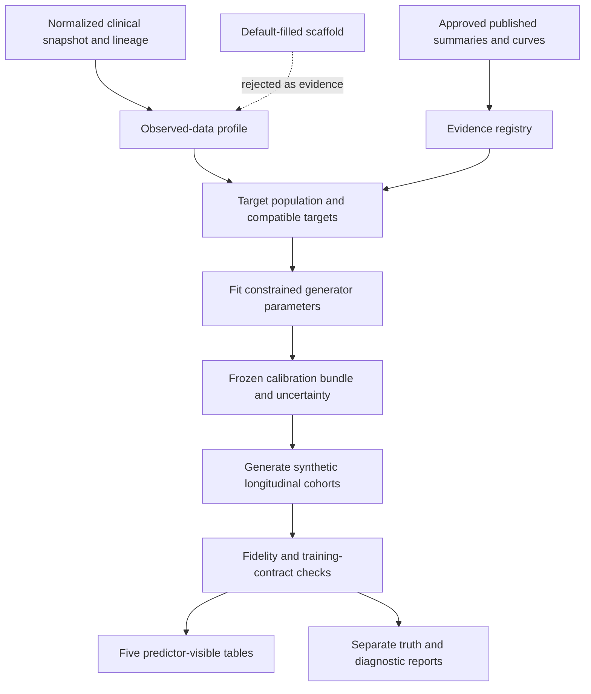

# KAIROS evidence-calibrated synthetic cohort generator

Date: 17 September 2026. Status: **v1 implemented 17 September 2026** (`src/kairos/calibration/`, generator 2.1 registry and calibrated mode, jobs `profile-observed`, `calibrate-generator`, `validate-calibration`, `generate-calibrated`, `validate-cohort`, `train-calibrated`, `evaluate-calibrated`; deviations 31-38). No normalized snapshot exists yet and no external target has been reviewed, so real calibrations report `insufficient_evidence`; the machinery is exercised by synthetic parameter recovery. No curve reconstruction was run.

Related designs: [standardization service](D:/Dyania/docs/kairos_data_standardization_service_design.md), especially its model adapter and optional training defaults; [configuration](D:/Dyania/config/generator_calibration.yaml).

## 1. Decision and scope

Create a **separate `kairos.calibration` module**, sharing the existing batch-job runtime and optional service control plane. It consumes immutable outputs from the standardization service and a versioned registry of external statistical evidence. It produces calibrated generator specifications, synthetic cohorts, and fidelity reports. It does not need a separately deployed HTTP service initially.

This separation gives three independent contracts:

1. Standardization preserves and encodes observed clinical evidence, including uncertainty.
2. Calibration estimates a constrained population/trajectory model and quantifies which parameters are supported by evidence.
3. Generation draws new synthetic people and histories from that frozen model; prediction-model training consumes the resulting five-table cohort.

Here, calibration means matching generated population statistics to evidence. It is distinct from calibration of a prediction model's probabilities in `evaluation/metrics.py`.

The first target is an interpretable conditional longitudinal simulator, extending the current implementation. A high-capacity learned generator is not the initial approach because only 17 supplied patients have structured medication and laboratory records. Published univariate distributions alone do not identify the joint distribution or patient-level treatment effects.

The module serves three named uses:

| Use | Output | Interpretation |
|---|---|---|
| Evidence-calibrated research cohorts | New synthetic patients matching declared compatible targets | Simulation evidence with a stated target population and uncertainty |
| Sensitivity/stress cohorts | Explicit shifts to assumptions, dependencies, mechanisms, or surveillance | Robustness experiments; deviations from calibration targets are expected and labelled |
| Standardization training scaffold | Synthetic companion episodes requested by `enable_training_defaults` | Pipeline testing only; cannot be returned as observed evidence to calibration |

## 2. Existing code and required extensions

The current generator already has separate random streams for static covariates, latent disease, visits, measurement noise, labs, treatment, and dp-ucMGP. It separates `truth` and `truth_visits` from predictor tables and uses the shared adjudication core for synthetic endpoints. Preserve those properties.

| Existing location | Current behavior | Proposed change |
|---|---|---|
| `simulation/generators.py::generate_cohort` | Draws from `ScenarioSpec`, with some distributions hard-coded | Accept a compiled calibrated specification; move all tunable distributions into an explicit parameter registry |
| `simulation/generators.py::_ref_draw` | Uses device/size reference values or class defaults | Preserve provenance, add supported correlations and context-specific distributions |
| `simulation/generators.py::_lab_value` | Fixed trajectories for selected analytes | Versioned analyte registry and supported conditional longitudinal processes |
| `simulation/generators.py::STUDY_END` | Fixed administrative end date | Make calendar/time-origin/eligibility specification explicit per population/study |
| `simulation/scenarios.py` | Reads literature-informed, assumed, and varied parameters | Keep legacy scenario mode; compile calibration artifacts through a dedicated adapter |
| `simulation/truth.py` | Prohibits latent truth columns in predictors | Extend the denylist as new latent processes are introduced |
| `km_reconstruct.py` | Approximate KM reconstruction; exercised only on synthetic inputs | Add a separately tested curve-ingestion workflow before using real reconstructed curves |
| `services/jobs/cli.py` | Scenario generation, training, evaluation | Add profile, calibrate, generate-calibrated, and validate-cohort jobs |

`data/reference/published_curves/` has no curve files at this inspection. Published point estimates already exist in `published_rates.csv`; they must be reviewed and registered rather than treated as fully digitized curves. Existing configuration references to the source aggregates are informal parameter guidance, not fitted calibration.

Do not assume current scenario parameters are statistically interchangeable with published estimates. In particular, the configuration currently documents using a subdistribution hazard ratio as a cause-specific coefficient in one scenario. Preserve that legacy scenario as labelled exploratory behavior; an accepted calibrated specification must resolve the estimand mismatch or keep that effect outside the fitted targets.

## 3. Data flow and ownership



The standardization service owns identities, vocabulary mappings, source decisions, and temporal precision. Calibration owns target definitions, population selection, statistical parameter fitting, and compatibility assessments. The generator owns simulated trajectories and observations. The shared adjudicator owns the KAIROS endpoint policy. No component silently rewrites another component's published artifact.

Calibration reads the **normalized research snapshot**, not only the training-ready subset. A patient with year-only dates may still support a cross-sectional device summary even if unable to contribute an exact-time trajectory. Every target has its own eligible denominator.

## 4. Input contracts

### 4.1 Observed-data profile

Required input: a published standardization manifest, table hashes, vocabulary/concept-set versions, date-precision extensions, coverage and duplicate decisions, source-lineage graph, and a frozen source partition manifest.

`ObservedProfile` contains:

- Source dataset/version, person count, source coverage, selection criteria, and population scope.
- Per-variable concept set, specimen/method, target unit, observation window, and result eligibility.
- Patient-weighted summaries, eligible patient/record counts, missingness reasons, and temporal support.
- Supported paired-variable summaries with paired-patient counts and the alignment rule.
- Repeated-measure summaries only where studies and timing can actually be resolved.
- Cluster-bootstrap uncertainty, support status, provenance, and targets deliberately not estimated.

Admit `observed` and supported `derived` values only when **all contributing ancestors** are accepted observations. Exclude synthetic defaults, schema placeholders used as values, synthetic companions, unresolved concepts/units, and unsupported derived quantities. A mixed/default-filled training manifest is rejected; users must reference its underlying observed research snapshot. Missing lineage is an input error, not permission to treat a value as real.

Source profiling policies:

- Use one result per person within a declared baseline window for baseline distributions. Prefer the first eligible result under a frozen rule; do not pick the most abnormal result unless that is the stated estimand.
- If there is no defensible baseline window, label the summary as an export-level cross-sectional description; do not fit an implantation-baseline distribution to it.
- For longitudinal summaries, give patients equal total weight and retain correlation within patients. Resample people, not individual lab rows.
- Year-only repeated records support annual descriptive summaries where appropriate, but not exact visit intervals, dose duration, subannual slopes, or ordering within a year.
- Account for uncertain duplicates through exclusion/sensitivity policies; 5,807 medication rows are not 5,807 independent medication decisions.
- Do not convert `<5` suppressed cells into exact counts. Prefer authorized private summaries; otherwise omit those point targets or implement explicit interval-valued targets later.

Initial engineering support settings: at least 30 distinct eligible people for an independently fitted local distribution and 50 paired people for a locally fitted dependency. These are conservative project defaults, not universal sample-size guarantees. Below them, report descriptive summaries and use external priors/sensitivity assumptions. With the current inputs, most lab/treatment dependencies will remain prior-driven. Parameter dimension and information content still require review even above these thresholds.

### 4.2 Evidence registry

One `EvidenceTarget` describes a statistical quantity, not merely a variable name:

| Field group | Required content |
|---|---|
| Identity | `target_id`, source citation/URL, source location, extraction/reviewer status, release/hash |
| Population | Study/cohort/arm, geography/setting if relevant, age/route/device/era inclusion criteria, analyzed denominator |
| Meaning | Variable/concept set, units, specimen/method, statistic/curve type, outcome definition, grade threshold |
| Time | Time origin, observation window, time unit, follow-up horizon, left truncation, censoring and competing-event treatment |
| Values | Estimate/coordinates, sample size, risk table if available, uncertainty representation, digitization uncertainty |
| Dependency | `study_group_id`, overlapping-cohort IDs, target covariance where supported, shared comparator/denominator |
| Role | `fit`, `holdout`, `sensitivity`, or `excluded`; compatibility decision and reason |
| Acceptance | Predeclared tolerance in natural/statistical units, weight, supported time range, mandatory/optional status |

Supported initial kinds: categorical proportions, means/SDs, quantiles, paired correlations, longitudinal means/quantiles, KM survival, cumulative incidence, and log effect estimates with an explicit effect type. Do not treat SD as SE; preserve which is reported. A mean/SD pair does not prove normality. Conflicting studies stay identifiable and can define separate populations or sensitivity scenarios.

For curves, store long-form rows with `target_id`, time, estimate, lower/upper limits and their type, and numbers at risk where available. Preserve digitized coordinates, image/page reference, calibration axes, transformations and review corrections. Validate ranges, time units, ordering, and expected monotonicity; do not silently repair a substantive reversal. Automatic LLM extraction may propose coordinates/metadata but cannot approve a curve or infer absent uncertainty.

`km_reconstruct.py` must not be applied to a CIF or biomarker trajectory. KM reconstruction produces approximate event/censoring data, not recoverable real patient identities, covariates, or cross-variable correlations. Its existing even-censoring simplification requires an explicit validation/uncertainty comparison before quantitative use. [Guyot et al.](https://pubmed.ncbi.nlm.nih.gov/22297116/) provide the underlying reconstruction method.

### 4.3 Target population specification

No calibration runs without a `PopulationSpec` defining the intended population, index procedure, devices/eras, time zero, event definitions, sampling weights, and observation policy.

Provide two presets:

- `local_export_like`: reproduce what is estimable about the supplied export; disclose that it may be a selected sample and cannot establish general AVR prevalence.
- `external_population`: use a specified study/registry population and compatible external mix; the local export informs only transportable components after documented compatibility checks.

Do not simply pool 117 note patients, 17 structured patients, and thousands of subjects in external studies into one denominator. External sample sizes influence uncertainty within compatible targets, not automatic dominance across different populations. Overlapping publications share a study group and cannot be counted as independent replications.

Create a study-specific reporting view for every external target. For example, an implantation-origin intention-to-treat curve must be simulated from implantation, including pre-reference events. The existing generator excludes people who die before the reference study; comparing only its retained cohort to that curve would condition on survival and bias calibration. Generate an enrolled population first, derive study views, then derive the KAIROS reference-eligible cohort. Similarly, all-cause mortality after an SVD event remains part of a study's mortality curve where the source follows it.

## 5. Statistical generation model

### 5.1 Baseline dependence

Use a small, reviewed conditional graph with at most three parents per fitted conditional distribution initially. A default ordering is:

1. Population/implant era and route.
2. Device model/class conditional on route, era, and market/size support.
3. Demographics and body size conditional on the target population and route.
4. Comorbidities and renal/metabolic state conditional on supported baseline characteristics.
5. Implant size and reference echo jointly conditional on device, body size, and supported covariates.
6. Medication indications and baseline treatment conditional on observed clinical state.

This is a generative factorization, not a claim that these arrows establish causality. Capture selection and indication explicitly; do not interpret observational medication associations as randomized treatment effects.

Use categorical/Dirichlet models for supported frequencies; suitable bounded or transformed distributions for continuous variables; and simple regularized conditional regressions. Hierarchical pooling across device class/route supplies sparse groups without pretending unsupported model-specific estimates are precise. Baseline counts and external prior strength are recorded separately.

Residual correlation, including gradient/EOA/DVI dependence, is represented through a low-dimensional factor or shrunk correlation model only where supported. Validate positive definiteness and clinically feasible combinations; correlations unavailable from evidence are fixed sensitivity parameters, not learned facts. Sampling each variable independently is an explicit baseline comparator, not the calibrated default.

Move hard-coded diabetes prevalence, eGFR distribution, body-size distributions, LVEF/SVI defaults, and marker equations into the registry before attempting to calibrate them. Unsupported analytes remain unavailable; a variable's presence in the model feature list does not imply an implemented generator.

### 5.2 Longitudinal processes

Each patient has stable random effects for baseline state and progression, and separate within-person innovations. A proposed numerical process for suitable transformed markers is:

`g(Y_i(t)) = population_mean(t, X_i) + patient_intercept_i + patient_slope_i*t + treatment_term_i(t) + residual_i(t)`

The transformation `g`, covariance, valid support and treatment term are analyte-specific and versioned. Cross-marker innovations can share a small latent factor; serial correlation depends on elapsed time, so irregular visits do not imply identical correlation. Do not fit this model to year-only records unless an explicitly compatible annual model is specified.

Retain the existing distinct stenotic, abrupt-regurgitant and reversible-thrombosis mechanisms, extending their parameters rather than collapsing them into one biomarker drift. Separate progression from measurement noise, and acknowledge that sparse records may not identify both. Reject impossible values by bounded distributions or documented transforms; monitor any clipping/rejection frequency rather than hiding it.

Treat medicines as episodes with indication, start/stop/switch/adherence semantics. Disease severity affects treatment decisions and testing; treatment may affect the simulated process only through declared, independently sourced or varied assumptions. Preserve post-suspicion starts for reverse-causation experiments. Do not estimate a causal treatment benefit from the 17-person prescription subset.

### 5.3 Observation and missingness

Simulate four distinct mechanisms: source/domain capture, visit scheduling/attendance, test ordering within attended visits, and measurement/reporting error. Administrative follow-up and dropout are separate from death and replacement. A lack of a lab file is not the same as a missed test after enrollment.

Version population-specific models of attendance and testing conditional on available history; latent-state dependence is permitted only as an explicit missing-not-at-random sensitivity scenario. Keep latent truth and complete scheduled visits in `truth`/`truth_visits`; observed tables contain only captured information. Allow an optional de-identification view that truncates simulated dates to years for comparison with the source export without losing exact synthetic dates internally.

### 5.4 Outcomes and compatible curves

Simulate cause-specific processes for SVD-related progression, death, and non-SVD replacement, including reversible thrombosis where relevant. Obtain the KAIROS SVD endpoint from observed echoes/treatment history and the shared adjudication policy, not by copying a latent onset time into the event table.

For competing events, the target CIF depends on all hazards:

`F_k(t | X) = integral_0^t S(u | X) * h_k(u | X) du`, with `S = exp(-integral sum_k h_k)`.

Accordingly, calibrate death, replacement and SVD observations jointly. Do not substitute `1 - KM` for a CIF, or a Fine–Gray coefficient for a cause-specific log hazard coefficient. See [Austin, Lee and Fine](https://pmc.ncbi.nlm.nih.gov/articles/4741409/) for these distinct estimands. In this simulator the reporting operator also includes progression, detection, reference eligibility, and confirmation; matching only latent hazards is insufficient.

An external endpoint differing from KAIROS can be used only with an explicit source-specific reporting operator or a separate sensitivity scenario. For example, matching severe haemodynamic deterioration does not by itself validate the current moderate-or-severe adjudicated endpoint. A hazard ratio target is compared using the corresponding analysis and covariate adjustment on the simulated study view, not copied blindly into a parameter.

Initial hazard families reuse Weibull/Gompertz structure where compatible. Add low-dimensional piecewise hazards only when multiple supported curve points justify them; a single 10-year risk cannot identify a full hazard shape. Extrapolation beyond the supported horizon stays a named sensitivity assumption.

## 6. Calibration algorithm

Use bounded **simulated minimum distance with prior regularization** in v1. It is implementable around the existing simulator and tolerates observed endpoints determined by discrete adjudication. Do not call its fitted parameter ensemble a Bayesian posterior.

1. Freeze source partitions and designate target groups for fitting versus validation before profiling/fitting. Keep overlapping studies together. If there is no usable independent evidence, declare external validation unavailable.
2. Build supported local targets and ingest approved compatible external targets. Unsupported targets get explicit exclusions, never silent removal to improve fit.
3. Fix weakly identifiable parameters to reviewed priors or vary them in a sensitivity grid. Fit only a small declared parameter set; save bounds, transformations, starting values, free/fixed status, and evidence links.
4. Draw an initial bounded parameter design, evaluate it using common simulation seeds, and refine the best candidates with a derivative-free bounded optimizer. Reuse the same random streams across candidates to reduce objective noise.
5. Generate each source-population study view, calculate its corresponding summary/curve, and evaluate the objective. Only approved fit targets enter it.
6. Re-evaluate finalists on independent diagnostic seeds. Check stability, residuals, boundaries, target conflicts, parameter sensitivity and identifiability.
7. Freeze accepted fits and run held-out target comparisons. An optimizer terminating successfully does not imply acceptable calibration.

Proposed objective:

`L(theta) = sum_over_study_groups w_g * D_g(simulated_targets(theta), observed_targets) + lambda * prior_penalty(theta)`.

`D_g` is a standardized discrepancy using source uncertainty, Monte Carlo uncertainty, and a documented population-mismatch allowance. Use covariance-aware distances where covariance is available and stable. Otherwise use normalized block distances, cap total weight per study, and disclose that this is not an independent-point likelihood. Densely digitizing one curve must not give it hundreds of times more influence than another study. Multiple correlated biomarkers and published contrasts from a shared control group also belong to the appropriate block.

Target tolerances, source weights, uncertainty assumptions and prior penalties are declared before fitting. Targets without defensible uncertainty can inform sensitivity ranges but do not receive invented narrow standard errors. Priors preserve plausible behavior where evidence is absent; evidence-poor coefficients should not be tuned until every observed curve matches exactly.

Use patient-cluster bootstrap profiles and jointly perturbed external target blocks for parameter uncertainty where the source uncertainty permits it. When only pointwise curve intervals exist, do not sample each coordinate independently; use justified monotone curve ensembles or retain these as sensitivity bands. Bootstrap refits and declared sensitivity parameter sets remain separately labelled. Independent generation seeds represent sampling/measurement randomness; they are a different uncertainty dimension from parameter draws.

Engineering budgets in `config/generator_calibration.yaml` are initial defaults, not scientific results: 32 starting evaluations, four refinements, 200 total objective evaluations, 2,500 attempted subjects per evaluation, three common fit seeds, and three diagnostic seeds. A time/evaluation budget exhausts into `incomplete` unless the declared acceptance procedure has finished. Warm starts and checkpoints must not alter frozen fit/holdout roles.

Generation counts refer to attempted people before eligibility exclusions. Record enrolled, reference-eligible, retained, and usable-landmark counts separately. Never regenerate until a desired event count or prediction score appears. Increase numerical sample size only through a recorded calibration precision policy, not outcome cherry-picking.

## 7. Calibration bundle and generated artifacts

An immutable `CalibrationBundle` contains:

- Observed snapshot, source partition, vocabulary and evidence-registry fingerprints.
- Population/study specifications and reporting-operator versions.
- Parameter definitions, fitted/fixed values, uncertainty/sensitivity sets, support and identifiability status.
- Generator, endpoint, concept-set and configuration versions; reproducible seeds and code/environment fingerprint.
- Per-target fit residuals, held-out residuals, tolerances, excluded targets and reasons.
- `fit_status`, `structural_status`, `independent_validation_status`, scope limitations, and allowed generation purposes.

Acceptance states are explicit: `accepted_for_simulation`, `failed_targets`, `insufficient_evidence`, `nonidentifiable`, or `incomplete`. Independent validation is separately `passed`, `failed`, or `unavailable`. An accepted calibration fit without independent targets can support labelled simulation, but cannot acquire an externally validated status.

Each generated cohort uses one parameter draw/setting for the entire cohort plus independent patient-level streams. Multiple cohorts cross parameter settings with declared seeds. Do not draw a different population parameter set per patient unless it is explicitly a population random effect.

```text
calibration/<bundle_id>/
  manifest.json
  population.json
  evidence/targets.parquet
  evidence/curves.parquet
  profile/observed_summary.parquet
  parameters/specification.json
  parameters/fits.parquet
  parameters/uncertainty_sets.parquet
  diagnostics/target_residuals.parquet
  diagnostics/identifiability.json
  report.md
scenarios/calibrated/<bundle_id>/<quick_or_full>/<replicate_id>/
  manifest.json
  patients.parquet
  echoes.parquet
  labs.parquet
  exposures.parquet
  events.parquet
  truth/truth.parquet
  truth/truth_visits.parquet
  diagnostics/fidelity.json
  diagnostics/fidelity.md
```

All calibration artifacts derived from private records remain private by default. Synthetic outputs are not automatically anonymous; evaluate unusual combinations, near-duplicates and disclosure risk before shared release. A patient-conditioned scaffold remains as restricted as its source-derived information. Shared calibration summaries follow the project's small-cell policy.

Generated cohort manifests preserve current five-table and endpoint contracts with `source_kind=synthetic`, `generation_kind=calibrated`, calibration bundle/hash, parameter-set ID and type, seed, population ID, target scope, counts, table hashes, acceptance statuses, and a label such as `synthetic, evidence-calibrated for specified targets; clinical predictive validity unestablished`. The existing illustrative/unvalidated model label remains applicable.

Synthetic truth never enters the landmark builder. Curves and calibration diagnostics are not predictor features. Attach parameter provenance at the generator/feature-family level, including the fraction of parameters that remain assumed; do not describe every simulated value as empirically learned.

## 8. Interfaces and defaults-mode integration

Proposed Python interfaces, not implemented APIs:

```python
profile_observed(snapshot, population, source_split, policy) -> ObservedProfile
validate_evidence(registry, population) -> EvidenceValidation
compile_targets(profile, registry, population) -> TargetSet
fit_generator(targets, parameter_spec, config) -> CalibrationBundle
validate_bundle(bundle, heldout_targets, diagnostic_seeds) -> CalibrationReport
generate_calibrated(bundle, n_attempted, seed, parameter_set_id) -> ClinicalCohort
evaluate_fidelity(cohort, bundle, evaluation_targets) -> FidelityReport
```

`ClinicalCohort` is the neutral five-table contract proposed in the standardization design. Initially adapt the existing `Cohort` implementation and retain separate truth storage. The compiled generator specification is a separate object; it must not put an unsupported `calibrated` value into the current `ScenarioSpec` label enum. Add calibration provenance explicitly, or version the enum/parser with migration tests before changing it.

Proposed job commands:

```text
kairos-jobs profile-observed --dataset <manifest> --population <spec> --split <manifest>
kairos-jobs calibrate-generator --profile <manifest> --evidence <manifest> --config <yaml>
kairos-jobs validate-calibration --bundle <manifest> --targets <holdout-manifest>
kairos-jobs generate-calibrated --bundle <manifest> --n 2500 --replicates 10 --seed 3201
kairos-jobs validate-cohort --cohort <manifest> --bundle <manifest>
```

These names describe future CLI subcommands; current `services/jobs/cli.py` does not provide them. The same functions can run through `/v1/calibrations` and `/v1/cohort-generations` on the standardization service's control plane. POST requests return a job ID; GET returns resumable status and immutable result manifests. Dataset-scoped authorization and private artifact access apply. No new HTTP application is necessary for v1.

Defaults-mode integration:

- `enable_training_defaults=false` leaves real-data export semantics unchanged and does not prevent independent calibrated simulation.
- With defaults enabled, a new `generator_backend: calibrated_bundle` can supply the scaffold's synthetic companion episodes. It requires an explicit accepted bundle manifest; missing or rejected bundles fail with a reason, without silently falling back to a different generator.
- `generator_backend: scenario` remains the explicit scenario-based fallback defined in the earlier design.
- Scaffolds keep `source_kind=real_with_synthetic_defaults`, field-level default provenance, private person links and pipeline-test-only eligibility. A calibrated backend does not convert their generated values into observations.
- The generator may use approved baseline constraints for a companion episode; it cannot splice simulated dates/outcomes onto real longitudinal records. Calibration itself consumes neither companions nor completed/default-filled features.

Add a dedicated calibrated-cohort storage prefix resolver, since the current scenario prefix accepts only its existing layout. Extend training/evaluation dataset loaders and manifest validation rather than disguising calibrated bundles as one of the six legacy scenarios. Preserve legacy scenario regression behavior. Models trained on calibrated synthetic cohorts stay experimental, with complete source lineage and no automatic served-model promotion.

## 9. Validation and interpretation

Separate four questions in every report: structural correctness, resemblance to fit targets, generalization to independent targets, and usefulness for testing a prediction model. They do not substitute for one another. [A published EHR-generation benchmark](https://www.nature.com/articles/s41467-022-35295-1) similarly examines distributions, dependencies, consistency and utility rather than relying on marginal distributions alone.

| Dimension | Metrics/checks | Required interpretation |
|---|---|---|
| Structure | Schema, valid keys, standard units, domain/device constraints, chronological ordering | Zero unexplained hard violations |
| Baseline | Proportion differences, standardized mean/quantile discrepancies, Wasserstein distance where appropriate | Compare within the declared population, units and baseline window |
| Dependencies | Supported conditional contrasts, paired correlations and joint subgroup counts | Report source paired N and unidentifiable dependencies |
| Longitudinal | Change/slope distributions, within-person variance, elapsed-time autocorrelation | No claims of subannual fit to year-only records |
| Treatment/observation | Episode overlap/switches, test/visit intervals, source capture, missingness conditional on state | Preserve distinctions between treatment, prescription and observation |
| Outcomes | Matched endpoint curves, confidence bands, risk sets, competing-event probabilities and subgroup patterns | Use identical origin, population selection and reporting operator |
| Numerical support | Monte Carlo error, optimizer seed stability, bound hits, bootstrap-fit failures | More simulated rows reduce Monte Carlo error, not uncertainty in the evidence |
| Training contract | Landmark eligibility, endpoint-echo exclusion, forbidden columns, patient-grouped splits, unique-event support | Passing means the model can consume the cohort, not that its clinical predictions are validated |
| Privacy | Source-neighbor distance, exact/rare combination overlap and disclosure testing appropriate to release | Synthetic labelling alone is not a privacy guarantee |

Fit targets are not held-out validation targets. If a published curve helped determine parameters, matching it is calibration-fit evidence. Future external real-data evaluation must be excluded from profiling, priors fitted to local records, target selection, and generator calibration. Training on synthetic and testing on independent real data is optional only where a sufficient suitable real evaluation cohort exists; do not promise such validation from the current 17-person subset.

Report prediction-model performance across multiple generator settings, including different dependence and treatment-effect assumptions. A model using the same functional assumptions as the generator can appear artificially strong; include alternative compatible data-generating mechanisms as stress tests. No positive causal or clinical-accuracy claim follows solely from good synthetic test results.

## 10. Implementation plan and acceptance criteria

Proposed package layout:

```text
src/kairos/calibration/
  schema.py          # profile, target, population, parameter and bundle contracts
  observed.py        # provenance-filtered observed summaries and clustered uncertainty
  evidence.py        # approved registry, curve formats, study groups and compatibility
  populations.py     # source/target population specifications and sampling views
  targets.py         # estimators/reporting operators for every target kind
  parameters.py      # bounded definitions, priors, supported/fixed parameters
  compiler.py        # calibrated specification -> generator inputs
  fit.py             # objective, seeded optimizer, checkpoints and fit diagnostics
  uncertainty.py     # clustered bootstrap refits and labelled sensitivity ensembles
  validation.py      # structural, target-fit and independent-target reports
  bundle.py          # versioned artifacts, checksums and compatibility checks
```

| Work package | Deliverable | Exit criterion |
|---|---|---|
| G1: Contracts/profile | Typed schemas, origin/lineage filters and observed profile | Default contamination, repeated-patient weighting, uncertain dates, duplicate policies and denominators tested |
| G2: Evidence | Versioned registry and study reporting operators | At least one reviewed reference-distribution target and one compatible outcome target; no unreviewed code/curve substitution |
| G3: Generator refactor | Parameter registry, conditional draws, enrolled vs reference-eligible views | Legacy mode preserved; correct temporal/joint constraints; pre-reference deaths represented in relevant study targets |
| G4: Calibration | Bounded objective, compatible target blocks and frozen bundle | Recover known synthetic target parameters where identifiable; detect contradictory/nonidentifiable targets rather than force fit |
| G5: Ensembles/validation | Uncertainty and independent-seed/target reports | Fit and holdout roles isolated; uncertainty sources labelled; calibration status cannot imply clinical validation |
| G6: Integration | Jobs/API, loaders, scaffold backend and storage | Compatible five-table training input; defaults cannot feed calibration; no model pointer overwritten |

Essential tests include: one patient with many labs cannot dominate baseline counts; a derived value with one synthetic ancestor is excluded; suppressed counts remain unresolved; wrong unit/time origin/endpoint is rejected; overlapping publications do not multiply weight; a denser digitization leaves study influence stable; conflicting targets fail visibly; a CIF cannot enter the KM reconstruction path; missing exact dates cannot produce observed exact slopes; unsupported device-era-size combinations are rejected; changing surveillance preserves shared latent draws; all-cause mortality targets include the appropriate follow-up after SVD; quick/full outputs cannot collide; and held-out data cannot influence fitted profiles or parameters.

Initial scope deliberately does not estimate a full multivariate clinical model from 17 people. G1 can characterize those records while G2 supplies justified external constraints and G4 leaves unsupported parameters explicitly assumed. Success is a reproducible generator whose agreement, uncertainty and failures are measurable, producing useful simulation cohorts without overstating what the supplied data establish.
