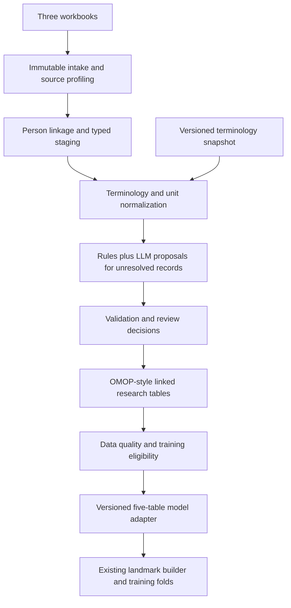

# KAIROS clinical data standardization service

Date: 17 September 2026. Status: proposed implementation design and configuration contract; no service, terminology download, data migration, or model retraining has been performed by this change. Updated with the requested opt-in training-defaults flag in section 8.1 and `config/standardization.yaml`; the flag is not yet connected to an executable service.

## 1. Purpose and deliverables

Build `kairos-standardize`, an asynchronous service that accepts the notes, medications, and laboratory workbooks, resolves their shared patients, standardizes clinical concepts and units, and publishes a versioned longitudinal dataset with source lineage. An explicit adapter then produces the five tables consumed by KAIROS training.

The service has three separate outputs:

1. **Normalized research dataset:** all patients and retained observations, linked through a common person identifier, using OMOP-style domain tables and explicit uncertainty extensions.
2. **Quality and review package:** source reconciliation, mapping coverage, conflicts, temporal uncertainty, clinical extraction review, and model eligibility reasons.
3. **Training dataset:** `patients`, `echoes`, `labs`, `exposures`, and `events`, generated only for records that satisfy the chosen model's input and timing contracts. A successful standardization run can legitimately produce no eligible real training cohort. The opt-in defaults mode additionally creates a labelled scaffold for pipeline testing, under the separate rules in section 8.1.

Clinical terminology encoding belongs here. Median imputation, scaling, splines, one-hot encoding, rare-category pooling, and learned feature selection remain inside training folds in `FeaturePipeline` and the existing eligibility machinery.

## 2. Current inputs and constraints

The supplied files are `.xlsx`, despite the earlier shorthand `.xls`. Support both formats with explicit reader selection and workbook signature validation; do not execute formulas, macros, or external links.

| Source | Observed input | Proposed handling |
|---|---|---|
| `notes_deidentified.xlsx` | 215 notes, 117 IDs; 13 Deleted records | Preserve the source inventory; exclude Deleted content from clinical extraction; retain exclusion reasons |
| `medications_deidentified.xlsx` | 5,807 rows, 17 IDs; 3,650 identical row repetitions | Normalize drugs and provenance; assess possible duplicate orders without assuming identical year-level records are the same prescription |
| `labs_deidentified.xlsx` | 43,550 rows, 17 IDs; numeric, categorical, narrative, and device records | Route by content and concept domain; normalize values and units; keep narrative and out-of-scope content outside numeric features |
| Shared identity | All 17 medication and lab IDs occur in notes | One person registry for the union; explicit three-source intersection and coverage matrix |
| Dates | Structured dates contain calendar years | Preserve precision and bounds; do not create exact clinical dates |

These counts are the earlier local audit baseline, not guarantees for future uploads. Recompute them in each run. The 100 notes-only patients remain in the research dataset with missing source coverage; do not inner-join them away. The 17-person intersection is a source-coverage cohort, not evidence of complete records or model eligibility.

Correction to the earlier discussion: the source date fields were already year-only. The preparation scripts did not cause that loss of precision. They also cannot restore it.

Current code constraints that the adapter must address:

- `modelling/landmark.py::build_landmark` accepts five tables and selects a reference echo 30–180 days after implantation; it requires chronology sufficient to implement that rule.
- `extraction/schema.py::parse_date` currently turns a year into 1 January. The real-data path must retain precision and reject that conversion as evidence of an exact date.
- `modelling/train.py` and the jobs CLI currently obtain their cohort from the synthetic scenario path. A real-data loader and manifest check are required.
- Medication features currently treat an absent stop date as continuing exposure and sum episode durations. Unknown stop dates and overlapping episodes must be resolved or explicitly marked unknown before those features are calculated.
- Existing lab features choose the latest record by date. Year ties, differing specimens, and retrospective note evidence require an explicit selection policy before this function is used.
- The old passport reduces each patient to a primary model and size. Re-extract procedure-level evidence from the source notes so sequential valves are not collapsed into one device.

## 3. Architecture

The proposed [evidence-calibrated generator module](D:/Dyania/docs/kairos_calibrated_generator_design.md) consumes this service's normalized research snapshots and approved external evidence. It shares the batch-job runtime but owns its statistical calibration separately. Training scaffolds and generated defaults are excluded from its observed-data inputs.

Implement one Python package with a FastAPI control service and a background worker, sharing the existing extraction and adjudication libraries. Avoid splitting terminology, lab conversion, and note extraction into separate deployed services initially.



Local execution uses private Parquet snapshots and SQLite for job/review metadata. A deployed implementation uses a Container Apps HTTP service, a Container Apps Job worker, private Blob storage for immutable artifacts, and a transactional database for jobs and reviews. PostgreSQL is the proposed database if a queryable OMOP deployment is required; confirm deployment sizing during implementation rather than provision it for this design.

Use a dedicated private `clinical` storage namespace. Existing `raw` storage is documented as owner-managed and read-only to application code; do not silently change that contract. Initial local mode can register the existing workbooks by checksum without copying them. A future upload endpoint stores its inputs in the new protected intake namespace.

Worker stages are resumable and idempotent. Publish a snapshot only after all files and a manifest have been written and validated; consumers resolve only published manifests. Retries must not duplicate events or mutate a prior version.

## 4. Terminology contract

Pin **OMOP CDM 5.4** as the initial compatibility target, rather than tracking whichever version is newest. Version the target explicitly so later upgrades are migrations. Use OHDSI vocabulary snapshots with RxNorm/RxNorm Extension, LOINC, SNOMED CT and applicable device, unit, and type concepts. Record vocabulary versions and hashes; obtain licensed vocabularies through the organization's permitted distribution mechanism.

| Data | Normalization target | Resolution strategy |
|---|---|---|
| Drugs | RxNorm/RxNorm Extension standard drug concepts; ingredient concepts for class derivation | Source RxCUI first, then curated exact matching, then constrained candidate search |
| Laboratory tests | LOINC mapped to the applicable OMOP standard concept | Source code validated against specimen, property, method, and scale; reviewed mapping where missing |
| Units | UCUM expressions plus OMOP unit concepts | Validated spelling normalization and analyte-specific conversion rules |
| Procedures/conditions | Domain-appropriate OMOP standard concepts, commonly SNOMED CT | Valid source code or evidence-supported extraction followed by vocabulary lookup |
| Valves | Standard device/procedure concepts plus KAIROS device metadata | Preserve model, manufacturer, size, valve position, and UDI/DI only when actually evidenced |
| Medication classes | Versioned KAIROS concept sets | Derive model classes from ingredient memberships; ATC may be a supporting classification |

RxCUI, LOINC code, and OMOP `concept_id` are distinct identifiers. Store the source vocabulary and code separately; look up the corresponding OMOP identifier. Resolve source mappings through the pinned vocabulary relationships and validate standard status, domain, and invalidation metadata. Unresolved standard concept fields use concept 0 with an explicit mapping status; they are excluded from concept-dependent features. Never insert a guessed numeric concept identifier. These choices follow the separation of source and standard concepts in the [OHDSI conventions](https://ohdsi.github.io/CommonDataModel/dataModelConventions.html).

[NLM describes RxNorm](https://www.nlm.nih.gov/research/umls/rxnorm/overview.html) names in terms of ingredient, strength, and dose form; matching must preserve those distinctions. Exact/normalized name lookup and approximate search are supported by [RxNav](https://lhncbc.nlm.nih.gov/RxNav/APIs/api-RxNorm.findRxcuiByString.html). Approximate scores rank candidates; this design does not treat them as calibrated probabilities.

Prefer local terminology lookup for reproducibility. Optional RxNav requests contain only a drug term or code, never a patient ID, date, diagnosis, or note. Cache responses with retrieval time and release metadata. An external API outage leaves unresolved work pending; it does not cause fabricated mappings.

## 5. Source processing

### 5.1 Intake and identity

Compute SHA-256 per workbook, enumerate sheets and headers, validate required columns, and record each physical row as `(file_hash, sheet, row_number)`. Preserve original structured cell values in restricted staging; retain narrative content in the protected source workbook and reference it by row and offsets rather than duplicating it into the metadata database. Content fingerprints are additional attributes, not substitutes for physical row IDs.

Map `Profile Key` in notes and `Patient` elsewhere through an exact, namespace-scoped identity crosswalk. Trim incidental whitespace; preserve leading zeros and never fuzzy-match identities. Conflicts stop linkage for the affected records. Allocate stable integer `person_id` values in a transactional crosswalk, preserving assignments across runs; expose only opaque IDs to downstream training. Separate source aliases from model features.

Track `has_notes`, `has_labs`, and `has_medications`, plus capture completeness and periods where known. Presence of a file or a row does not establish complete coverage. Record absent, unmeasured, unmapped, invalid, uncertain, and out-of-window as distinct missingness reasons.

### 5.2 Medications

1. Parse `Rx Norm Codes` as potentially multiple source identifiers. Validate each identifier, term type, status, and consistency with name, strength, and form.
2. Normalize drug spelling and structured strength/form/route without erasing combination ingredients or changing clinical meaning.
3. Prefer a supported product concept. If evidence supports only an ingredient, map at that level and mark specificity; do not infer a tablet strength or formulation.
4. Use curated mappings next. Retrieve candidates for remaining names; let the LLM rank those candidates with abstention, then validate and review as specified below.
5. Preserve prescribed dose separately from product strength. Preserve administration versus prescription evidence through source type. A prescription does not prove adherence.
6. Build drug records from source-supported starts/stops. Contradictory end/discontinuation fields create a conflict; the old rule taking the later year is not a normalization standard. Missing stop means unknown unless ongoing use is separately documented.
7. Derive VKA, factor-Xa inhibitor, direct-thrombin inhibitor, and antiplatelet memberships from reviewed ingredient concept sets. DAPT requires supported concurrent use of two relevant antiplatelet agents; a single aspirin record is not DAPT.

Keep all rows in staging. Exact repeated inputs across the same upload/run are idempotently recognized. Within the original export, identical medication rows without order IDs are **possible duplicates**: year truncation may have made separate orders identical. Store a duplicate group and multiplicity, and prevent duplicate-looking records from multiplying boolean exposure or cumulative duration. Preserve a sensitivity view until the source duplicate policy is confirmed. Union overlapping periods before computing cumulative use; flag competing simultaneous anticoagulant classes instead of choosing the first row.

### 5.3 Labs and measurements

1. Validate existing LOINC codes before reusing them. For missing codes, build a mapping signature from component name, specimen/system, property, time aspect, method, unit, and result scale. Name-only matching cannot establish all of these distinctions: see the [LOINC term structure](https://loinc.org/kb/users-guide/major-parts-of-a-loinc-term).
2. Preserve numeric and string representations and their agreement status. Parse inequalities such as `<x` into operator plus bound; do not present them to a numeric-only model as exact values. Route qualitative values to coded results where supported.
3. Normalize units using a versioned registry based on [UCUM](https://ucum.org/ucum). A unit parser validates syntax/dimensions; clinical conversion also requires the correct analyte and property. Mass-to-molar conversions need analyte-specific factors. Do not infer units from plausible-looking values alone.
4. Convert reference limits with the same rule where applicable and retain their source text. Flag implausible values; do not automatically clip extremes.
5. Keep clinically different measurements separate: serum versus urine creatinine, total versus ionized calcium, BNP versus NT-proBNP, calculated versus measured LDL, and differently indexed renal measures. Do not label total calcium as corrected calcium. Do not derive eGFR without the inputs and a versioned equation. Do not apply a universal mass-to-molar factor to Lp(a).
6. Treat `TRANSCRIPTION` as narrative. Retain its restricted source reference and optionally process it with the note extractor; it may contain relevant echo information. Device-interrogation and respiratory records are routed or marked out of current model scope rather than destroyed.
7. Preserve separate laboratory observations with distinct source row references. Identical patient/year/test/value combinations cannot be safely collapsed into one test when day/time is absent.

Record raw value/unit, normalized value/unit, selected concept, conversion rule/version, mapping evidence, and eligibility status. UCUM unit codes are not themselves numeric OMOP concept IDs.

### 5.4 Notes and LLM-assisted extraction

Reuse the rules and client transport in `extraction/rules.py` and `extraction/llm.py`, extending the output contract to candidate clinical facts rather than forcing every note into one patient passport.

For each fact retain its source offsets, clinical assertion, subject, temporal context, valve position, native/prosthetic context, and candidate procedure/study association. Separate confirmed, negated, possible, historical, planned, and family-history assertions. Link a gradient or valve size to its actual valve and study where supported. Repeated mentions are not automatically repeated procedures or studies. Conflicts between rules and LLMs go to review instead of automatically accepting either method.

Do not choose the longest valve name across a patient's entire history as the index device. Introduce distinct valve episodes and link subsequent valve-in-valve or redo procedures explicitly. Use the shared `grades.py` mapping for model regurgitation encoding while preserving the original text and standard coded finding.

LLM tasks are constrained to extraction, synonym interpretation, and ranking retrieved terminology candidates. A candidate response contains `source_row_id`, `field`, `candidate_ids`, `selected_candidate_id|null`, `evidence_offsets`, `assertion`, `event_time_bounds`, `abstain_reason`, and model/prompt versions. Validate that selected IDs belong to the supplied candidates, concepts satisfy domain rules, and spans correspond to the source. Reject unsupported dates, values, or clinical assertions.

At initial release, every novel LLM terminology mapping requires reviewer approval. Approved context-specific mappings enter a reusable dictionary. Note-extracted facts used for index procedures, reference studies, or outcome labels require review before real-data training. Lower-risk mappings can later receive automatic acceptance only after a held-out audit demonstrates the configured precision target; an LLM's self-reported confidence alone is insufficient.

Reuse the configured real-note LLM policy and existing approved endpoint. Do not send clinical content to a new provider as part of terminology matching. Source text is untrusted data, never operational instructions; extraction has no tool-execution authority. Cache by input hash, prompt/schema/model version, and terminology snapshot. Persist evidence offsets and restricted references, not note text in job logs or general database tables. Reviewers retrieve authorized source snippets on demand.

## 6. Consolidated structure and provenance

Use schema namespaces `staging`, `omop_style`, `kairos_ext`, and `training`. The canonical output is a relational collection linked by `person_id`, not a flat join of notes × drugs × labs. Such a flat join would multiply observations. Build model features from each domain separately at a defined prediction time, then join those features one-to-one.

The selected OMOP-style domain tables are `person`, `measurement`, `drug_exposure`, `procedure_occurrence`, `device_exposure`, `condition_occurrence`, `observation`, `observation_period`, and `death`. Populate visits only when supported by encounter evidence. Route facts according to their mapped concept domain. Preserve source code/value and type along with the standard concept and event identifier.

There are two explicit profiles:

- `omop_style_research_v1` preserves uncertain dates and missing demographics using nullable staging-compatible fields and extensions. It is the initial deliverable and is **not a conformant OMOP CDM instance**.
- `omop_cdm_5_4` is a separate validated export using the official DDL, all required tables/fields, and documented conventions. For example, `PERSON.year_of_birth` is required; absent birth-year evidence prevents that person's strict export. Do not invent demographics to pass validation. Report all export exclusions. See the [CDM 5.4 specification](https://ohdsi.github.io/CommonDataModel/cdm54.html).

Under the existing policy against copying note text into the database, keep narratives in the protected source files and extraction evidence in extensions. Leave standard NOTE/NOTE_NLP tables unpopulated in a strict export unless a separately established text-storage policy supports valid records; do not create fake note text to satisfy required fields.

Proposed extension tables:

| Extension | Grain and principal fields |
|---|---|
| `source_record` | One physical source row: file/sheet/row reference, hash, source type, ingestion time, disposition |
| `record_lineage` | Many-to-many relation: normalized table/record ID, source row ID, transform version, field-level evidence |
| `mapping_decision` | One versioned decision: source signature, candidates, selected concept, rule/LLM/manual method, status, reviewer, vocabulary snapshot |
| `event_time` | One date role per record: lower/upper bound, precision, source expression, derivation, date-shift compatibility |
| `source_coverage` | Person × domain × supported interval: records present, completeness known/unknown, evidence |
| `valve_episode` | One supported implanted valve episode: person, position, procedure/device links, candidate start/end, predecessor |
| `echo_study` / `echo_measurement_link` | One evidenced study and its measurement links; timing, valve episode, native/prosthetic status |
| `clinical_assertion` | One extracted fact: assertion/subject/time context, offsets, review status; no general-access note text |
| `outcome_adjudication` | Episode-level candidates, confirmation, mechanism, status, reviewer, policy, and evidence links |
| `duplicate_group` / `quality_issue` | Potential duplicates, conflicts, exclusions, severity, resolution, and affected records |
| `feature_lineage` | Model row/feature → contributing clinical record IDs, selection/conversion rules, and eligibility reasons |

Foreign keys, stable IDs, immutable revisions, and table hashes make every model input traceable to a source cell or text span. Keep terminology IDs and quality metadata out of the feature matrix unless a feature definition explicitly uses them.

## 7. Temporal semantics and outcome eligibility

Represent a source year as a bounded interval, for example `[2020-01-01, 2020-12-31]`, with `precision=year`. Those are uncertainty bounds, not an assertion that treatment continued throughout that year. Represent clinical event time and when evidence became available separately. A historical result mentioned in a later note is not automatically usable as a predictor at its historical event time.

For an exact landmark, a feature is eligible only if the evidence supports it having been available on or before that landmark. An unresolved interval overlapping the landmark cannot establish ordering. A finer date extracted from narrative requires evidence, review, and compatibility with the structured date-shift system. Do not mix differently shifted timestamps or recover original dates by inference.

The default `current_landmark_model` export requires validated day-level implant/reference/study timing and adequate follow-up/outcome ascertainment for each included episode. Year-only records may still contribute non-temporal context or separately defined exploratory annual summaries, but cannot establish the reference window, exact slopes, exposure duration, or post-suspicion treatment timing. An annual or interval-censored model would need its own statistical design and endpoint definition; it is not an automatic fallback for the existing Cox pipeline.

Do not use first/last available lab dates as evidence of continuous observation or complete mortality ascertainment. Store capture extent separately and define observation/follow-up policy using source coverage evidence. [OHDSI's EHR observation-period guidance](https://ohdsi.github.io/CommonDataModel/ehrObsPeriods.html) explains why coverage needs an explicit ETL policy.

Outcome construction reuses the versioned adjudication core with reviewed study grouping and reference selection. A mention of SVD, endocarditis, thrombosis, redo, or death is a candidate, not an automatic training label. Unavailable outcome ascertainment is unknown, not event-free. Censoring requires a supported follow-up end. Keep adjudication data separate from predictors and apply the existing endpoint-echo leakage exclusions.

## 8. Adapter to the training model

Publish all five model input tables as private Parquet with a typed schema and a manifest:

| Table | Grain | Source and adapter policy |
|---|---|---|
| `patients` | One selected index valve episode per person in v1 | Reviewed valve episode plus supported static covariates; missing attributes remain missing |
| `echoes` | One validated study per selected episode | Pivot only measurements demonstrably belonging to that study and valve; never combine different studies to fill missing fields |
| `labs` | One eligible result | Map reviewed concept sets to KAIROS analytes with required units, specimen, method, operator, and timing checks |
| `exposures` | One resolved medication episode | Derive ingredient classes, merge supported overlaps, preserve prescribing/adherence distinction |
| `events` | One endpoint/observation record per selected episode | Reviewed adjudication plus supported death, replacement, and censoring dates; current endpoint schema version |

V1 selects the earliest adequately evidenced eligible aortic valve episode under a versioned selection rule; later replacement ends that episode's follow-up. If selection is ambiguous, exclude and report. Preserve every episode in the research layer. A later multi-episode model must group all episodes from the same person together in resampling.

Introduce a neutral `ClinicalCohort` contract shared by synthetic and real loaders, keeping synthetic truth tables outside its predictor-visible interface. A real manifest includes `source_kind=real`, dataset/adapter/endpoint/schema versions, terminology and source hashes, concept-set versions, date policy, coverage, excluded records/persons, and readiness status. Do not label real data as a simulated scenario to reuse `Cohort.load`.

Extend the model boundary before enabling real exports:

1. Carry an explicit medication-coverage contract to feature construction. Empty exposures can mean known none, incomplete capture, or unknown timing; do not infer availability merely from membership in the exposure table. Unsupported exposure status stays missing.
2. Add deterministic study/result selection and analyte-specific staleness rules shared by training and prediction. Ambiguous same-year results do not acquire arbitrary chronological order.
3. Retain feature provenance and available-at checks; labels, review metadata, identifiers, and post-landmark information must not enter predictors.
4. Let fold-specific eligibility disable unavailable modules; retain existing training-only imputation/encoding for eligible features.
5. Require model-support checks on unique patients/events and valid splits. Standardization success does not imply that this small cohort supports fitting or validating the full model.

Use all source-covered patients for characterization and report the 17-person intersection separately. Choose modelling cohorts by endpoint, observation, and feature eligibility rather than requiring every patient to have every source. The current 17/117 medication/lab source coverage is about 14.5%; at the existing 20% anchor-availability threshold, those modules could be disabled if the training denominator remained 117. Eligibility must be recomputed within the actual training folds, not predetermined from the source intersection.

The jobs CLI gains `train --dataset <versioned-real-manifest>` and explicit source validation. It must refuse blocked manifests, legacy endpoint schemas, and missing hard requirements. Real model candidates write to their own versioned namespace and require the existing model evaluation/promotion process; they never replace `models/latest` merely because an ETL job completed. Model labels must accurately distinguish real versus synthetic training and retain validation status.

### 8.1 Opt-in flag: `enable_training_defaults`

User-requested addition: allow generated defaults so the output can provide a structurally valid, internally consistent base for testing training. Configuration is defined in `config/standardization.yaml`. The standardization service and CLI still need implementation; the examples below specify their future behavior.

```yaml
training_export:
  enable_training_defaults: false
```

The proposed export CLI flag is `--enable-training-defaults`; its boolean inverse is `--no-enable-training-defaults`. The API export request accepts `enable_training_defaults: true|false`. An explicit request overrides the configuration value, including an explicit false; absence inherits configuration. Default is false. Strictly parse the boolean, rejecting strings such as `"false"` instead of relying on their truthiness. Include the resolved setting in the manifest and export fingerprint.

When false, preserve the real-data eligibility rules above. When true, publish an additional `training_scaffold` export with `source_kind=real_with_synthetic_defaults`, `purpose=pipeline_test`, and `clinical_training_allowed=false`. Keep the original normalized tables and the real export/readiness report intact. The switch applies to the KAIROS model-input profile only; reject it for strict-CDM export rather than manufacture records to claim OMOP conformance.

The scaffold must pass the five-table schema, valid keys and references, supported units/concepts, reference selection, chronological consistency, exposure overlap, and leakage checks. These checks remain mandatory with the flag on. Structural readiness and clinical evidence quality have separate statuses; generated defaults cannot improve the reported completeness of observed data.

| Missing or incomplete item | Flag-on behavior | Limits and provenance |
|---|---|---|
| Required column/table | Create the typed column/table; use typed missing values where permitted | Record `schema_default`; empty medication tables are valid when absence/coverage semantics are explicit |
| Missing category | Use an explicit `unknown` category where the contract supports it | Unknown sex, route, disease status, or medication use must not become a measured negative or a specific value by convention |
| Missing numeric model feature | Generate a scenario-based value in the scaffold when the selected test module requires it and the generator supports it | Mark `synthetic_default`; use a frozen external scenario policy, not a median computed across the real dataset |
| Missing clinical dates/reference study | Generate a separate coherent synthetic episode with a valid implant, reference window, and follow-up sequence | Do not insert fabricated day precision into a real source record or reinterpret a year bound as an exact event date |
| Missing labs/exposure history | Generate supported synthetic results/episodes for the synthetic timeline | Record default status per value and episode; simulated drug use is not evidence of real treatment |
| Missing outcomes/censoring | Generate outcomes only as part of the separate coherent synthetic episode and derive its observed endpoint with the shared adjudicator | Do not fill a real patient's missing outcome with zero/event-free or splice a synthetic label onto real follow-up |
| Missing terminology code or uncertain unit | Preserve unresolved mapping and exclude the affected real result from numeric features; continue unrelated scaffold work | Never generate RxCUI, LOINC, or OMOP identifiers. A new synthetic result must independently use a validated concept and declared unit |
| Invalid/conflicting observed value | Preserve it in the research/audit layer and report the issue | The flag cannot silently overwrite an outlier, contradictory source code, or impossible date to obtain a pass |

**Completion procedure:**

1. Start with an immutable copy/reference of the normalized dataset and evaluate real-data readiness before any defaults are applied.
2. Add schema-level defaults without changing known clinical values. Preserve accepted real episodes that are already ready; mark any scaffold field augmentation explicitly. If the model cannot handle a missing optional feature, exclude that feature through the usual module policy unless a supported synthetic test value is requested.
3. If core chronology, an index valve, or outcome follow-up cannot be established, use a companion synthetic episode with a separate opaque ID. Keep the corresponding real episode outside that scaffold trajectory and report its exclusion reason. Never move real observations to artificial dates or combine them with a generated outcome. Accepted baseline attributes may condition the synthetic episode only when their timing and meaning are supported; record every such dependency.
4. Use a pinned `gradual_stenotic` scenario as the initial test policy, with its effective configuration hash and generator version. The generator must be extended to accept validated baseline constraints where conditioning is needed; the current generator is not a per-field completion engine. Generate temporally dependent echoes, labs, treatments, and outcomes jointly. Derive endpoint labels using the same adjudication policy as the model. Keep simulated latent truth outside predictor tables.
5. Use deterministic streams keyed by seed, policy version, opaque episode ID, and field/process. Adding another patient must not redraw existing patients. Stored outputs and provenance allow reproduction even if model/provider versions change later.
6. Run all structural checks and the existing landmark builder. Publish `training_status=ready_for_pipeline_test` only if the scaffold passes and produces usable landmark rows. Otherwise return `blocked` with specific failures. Valid structure alone does not promise a statistically estimable model: report unique patient/event support and unavailable modules separately.

Do not create additional patients or change random seeds until a preferred event count or model score is achieved. If 17 or 117 scaffold-linked subjects provide insufficient events for a proposed fit, report that result; use the independent synthetic scenario workflow for larger simulation experiments. Defaults must not be selected based on held-out outcomes or their effect on evaluation scores. Scores from this scaffold describe the test scenario and cannot be reported as performance on observed patients.

Add `kairos_ext.default_provenance` with one record per generated field (and generated-row linkage): `export_id`, table/record/field, original missingness or reason, generated value, `value_origin` (`observed`, `derived`, `schema_default`, `synthetic_default`), rule/policy, seed/stream, dependency record IDs, and generator/config versions. A derived feature inherits default status if any contributing value is synthetic. Keep the real-person-to-scaffold-ID link private and outside model features. Any retained real rows and their synthetic companions must share a grouping key for splits to avoid person-level leakage.

The quality report must show, separately:

- Structural checks passed/failed and usable landmark count.
- Observed completeness before defaults, per field/domain/patient.
- Synthetic completion rate after defaults, including entirely generated episodes.
- Real clinical readiness and unresolved real-data blockers.
- Independent-patient/event support for the requested model and available folds.

Proposed API example:

```json
{
  "profile": "kairos_model_inputs",
  "enable_training_defaults": true,
  "defaults_seed": 20260917
}
```

Example successful scaffold manifest excerpt (statuses conditional on passing checks):

```json
{
  "source_kind": "real_with_synthetic_defaults",
  "purpose": "pipeline_test",
  "training_status": "ready_for_pipeline_test",
  "clinical_training_allowed": false,
  "defaults_enabled": true,
  "defaults_policy_version": "training_scaffold_v1",
  "defaults_seed": 20260917,
  "structural_quality_status": "passed",
  "real_data_readiness_report": "quality/real_readiness.json",
  "default_provenance": "kairos_ext/default_provenance.parquet"
}
```

The dataset-loading and training contracts must explicitly recognize this new source kind and route it to a pipeline-test job/output namespace. It is not accepted by the real-data training route or strict-CDM validation. Experimental model bundles and scores inherit the defaults policy and synthetic-completion label, stay under `pipeline_tests/<export_id>/`, and cannot update the served model pointer automatically. The current extraction request enum remains `real|synthetic`; the mixed-origin marker belongs to the new dataset contract, not an unsupported value passed into the existing extraction API.

## 9. API, state, and output contract

All routes below are proposed, not implemented. Use authenticated dataset-scoped access; review writes are audited.

| Endpoint | Purpose |
|---|---|
| `POST /v1/datasets` | Register three private source references and checksums, source namespace, snapshot ID, mapping profile, and LLM mode |
| `POST /v1/datasets/{id}/runs` | Queue normalization with an idempotency key; return 202 and run ID |
| `GET /v1/runs/{id}` | Stage progress, counts, readiness, and recoverable failures |
| `GET /v1/runs/{id}/quality` | Machine-readable quality metrics and report links |
| `GET /v1/runs/{id}/reviews` | Paginated terminology/clinical review queue |
| `POST /v1/reviews/{id}/decisions` | Approve, replace, or reject with expected revision; conflict returns 409 |
| `POST /v1/datasets/{id}/exports` | Build a research, strict-CDM, or model export at a frozen decision revision; model exports accept the opt-in defaults flag from section 8.1 |
| `GET /v1/exports/{id}` | Status, immutable manifest, table inventory, private download references, and exclusion reasons |

Dataset registration rejects arbitrary network URLs and unrestricted server file paths; resolve only dataset-owned upload handles or configured local roots. A separate multipart upload can be added for remote use, with size and format checks before parsing.

Run states: `queued → profiling → normalizing → validating → completed`, with `review_pending`, `failed`, and `cancelled` as explicit alternatives. A research snapshot can publish accepted records while listing unresolved records; a training export evaluates independent readiness gates. Use `normalization_status`, `cdm_export_status`, and `training_status` rather than one misleading success boolean.

Example model-readiness response, illustrative rather than measured for a new run:

```json
{
  "dataset_id": "dataset-example",
  "normalization_status": "completed_with_review_items",
  "profile": "omop_style_research_v1",
  "training_status": "blocked",
  "blocking_reasons": [
    "REFERENCE_WINDOW_NOT_RESOLVABLE",
    "OUTCOME_ASCERTAINMENT_NOT_ESTABLISHED"
  ],
  "eligible_person_count": null,
  "manifest_uri": "clinical/dataset-example/version-example/manifest.json"
}
```

Private output layout:

```text
clinical/<dataset_id>/<version>/
  manifest.json
  omop_style/*.parquet
  kairos_ext/*.parquet
  quality/report.json
  quality/report.md
  quality/review_queue.parquet
  training/<adapter_version>/manifest.json
  training/<adapter_version>/{patients,echoes,labs,exposures,events}.parquet
  training/<adapter_version>/exclusions.parquet
  training_scaffold/<adapter_version>/<defaults_policy_version>/manifest.json
  training_scaffold/<adapter_version>/<defaults_policy_version>/{patients,echoes,labs,exposures,events}.parquet
  training_scaffold/<adapter_version>/<defaults_policy_version>/kairos_ext/default_provenance.parquet
  training_scaffold/<adapter_version>/<defaults_policy_version>/quality/real_readiness.json
```

Create real training tables only for a successful eligible real export; always allow a readiness/exclusion report. A scaffold export follows the independent structural gates in section 8.1. A strict-CDM export gets its own profile directory and validation report. Patient-level reports remain private; separately generated shared reports suppress small cells and avoid source identifiers/text.

The version fingerprint covers source hashes, mapping configuration, vocabulary snapshot, reviewed decisions, extraction cache/model/prompt versions, adapter code, and outcome policy. A review decision creates a new derived version rather than changing a published one. Capture progress with stage checkpoints and worker leases; retries use the same logical job ID. If a vocabulary snapshot is unavailable, profiling can complete while normalization reports a dependency failure. If the LLM is unavailable, deterministic mappings continue and remaining items enter review. Limit concurrency, retries, note length, and LLM cost per run; report unresolved counts rather than silently dropping work when a budget is reached.

## 10. Quality gates and acceptance tests

Report denominators separately for all source rows, distinct mapping signatures, unique patients, and eligible training rows. High row-level mapping coverage can otherwise hide a few frequently repeated mapped terms.

| Gate | Required behavior |
|---|---|
| Source accounting | Every source row has a disposition and lineage; one row may yield several facts, so reconcile lineage, not just output totals |
| Identity | No orphan facts, ID collisions, or cross-person joins; report union/intersection counts |
| Vocabulary | Every accepted nonzero concept exists in the pinned snapshot and satisfies the required domain/status rules |
| Units/results | Every transformed value has a tested rule and preserved original; unknown units and censored values cannot silently enter exact numeric features |
| Clinical extraction | Evidence spans verified; negation, experiencer, timing, native/prosthetic context, and valve identity retained |
| Duplication | Reruns are idempotent; potential source duplicates remain auditable; exposure overlap cannot inflate duration |
| Time | Precision preserved; no fabricated exact dates; future-year flags and incompatible shifts reported |
| Labels/follow-up | Evidence-backed endpoint and censoring policy; unresolved ascertainment blocks the affected episode |
| Leakage | No future evidence, endpoint-establishing echo, outcome fields, or synthetic truth in features; patient-grouped resampling |
| Reproducibility | Same inputs plus frozen decisions/versions produce identical clinical table hashes; report-generation timestamps excluded from content hashes |

For a conformant CDM export, add applicable [OHDSI Data Quality Dashboard](https://ohdsi.github.io/DataQualityDashboard/) checks. Research-profile checks must report which CDM requirements are unmet; a passing custom check suite is not a claim of full CDM conformance.

Create reviewed test cases for: combination drugs; mismatched source RxCUI/name; obsolete codes; aspirin plus a second antiplatelet with uncertain overlap; year-only duplicate prescriptions; missing stop dates; unknown medication coverage; serum/urine creatinine; total/ionized calcium; inequalities; unit variants; conflicting numeric/string values; transcription-derived echoes; copied historical results; negated thrombosis; two valve procedures; and conflicting shifted dates.

Audit terminology at the distinct-signature level and clinical extraction at the note/study level. Report accuracy and abstention separately, stratified by field and method, with uncertainty where sample size permits. Review all novel LLM mappings in the first release. Any future automatic acceptance precision threshold is a configured project criterion, not a claimed industry standard; tune it on held-out reviewed examples.

Defaults-mode acceptance tests must additionally prove: flag-off exports are unchanged; explicit false overrides a configured true; known clinical values and source tables are unchanged; generated values/rows have complete provenance; source completeness is unchanged by defaults; no invented standard concept IDs; unresolved year-only timelines create separate synthetic episodes; generated outcomes come from those episodes; overlap/dates/reference windows and leakage checks still apply; same seed/version is reproducible independent of row ordering; unsupported model support is reported without resampling to force a pass; and scaffold manifests are rejected by real-data training and served-model promotion.

## 11. Implementation work packages

| Package | Proposed code/artifact | Exit criterion |
|---|---|---|
| A: Contracts and intake | `standardization/schema.py`, `ingest.py`, `identity.py`, profile config | Three workbooks inventoried; stable IDs, year bounds, source reconciliation, no clinical data in logs |
| B: Terminology | `terminology.py`, `medications.py`, `labs.py`, concept-set registry | Code validation and curated mappings work offline; tested unit rules; unresolved queue |
| C: Narrative and review | `notes.py`, `review.py`, extensions to extraction schemas | Evidence-backed facts, procedure/study grouping, candidate-only LLM matching, revisioned review |
| D: Research export and QA | `omop.py`, `quality.py`, private storage namespace | Linked OMOP-style tables plus quality report; strict-export deviations explicit |
| E: Training boundary | `modelling/cohort.py`, `standardization/training_adapter.py`, landmark coverage/time updates | Compatible five-table contract, eligibility/exclusion report, leakage and missingness tests |
| E2: Opt-in defaults | `standardization/defaults.py`, generator conditioning contract, `config/standardization.yaml` | Flag-off preservation; reproducible and traceable scaffold; structural checks; source-kind isolation and no automatic promotion |
| F: Service integration | `services/standardize/app.py`, worker CLI, schema migration, deployment definition | Resumable jobs, access controls, immutable publication, reproducible reload |

Implement A–D before wiring real-data training. E must pass against controlled fixtures with exact dates and reviewed outcomes, and must demonstrate the expected blocked/partial result on year-only inputs. F packages the validated pipeline; it does not change its scientific contracts.

The expected first real deliverable from the supplied workbooks is a standardized, linked research dataset covering the full 117-person union, a 17-person three-source coverage subset, and a quantified training-readiness report. The number actually eligible for the existing prediction model remains to be determined. Completing the terminology mapping alone cannot supply missing longitudinal timing, patient characteristics, or outcome follow-up.

Generator integration is specified in `kairos_calibrated_generator_design.md`. The defaults configuration can explicitly select `generator_backend: scenario` or `calibrated_bundle`. The latter requires an accepted `calibration_bundle_manifest`; it supplies labelled synthetic companions only and cannot improve the observed-data quality score or real-data training status. Invalid/missing bundles fail without silent fallback.
